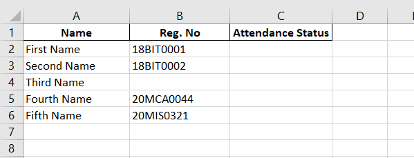

# Club Attendance Form Automation

This is a python script that makes it easy to mark attendance for your Club/Chapter in the SW Google Form

## Requirements
Chrome Browser, Python 3, Webdriver, Selenium, Pandas
## Installation of Requirements

Use the package manager [pip](https://pip.pypa.io/en/stable/) to install selenium and pandas.

```bash
pip install selenium
pip install pandas
```
Download the required chromedriver executable according to your operating system and Chrome Browser version from the [official website.](https://chromedriver.chromium.org/downloads)
Place the executable in the same folder as this code and change the path in attendance_driver.py


## Usage
Enter the correct values of variables in the variables.py file according to your event. The default google form link is a cloned copy of the original for testing purposes.

```python
# Add the original google form link, this is a cloned form for testing
google_form_link="https://docs.google.com/forms/d/e/1FAIpQLSckKFDYqXQ9MeN-1YkfwiHEUgswCnpwCggOixFDX38cUxrCSA/viewform"
# Add your club email
club_email="demo@gmail.com"
#Choose option as Club/Chapter (remember to capitalise 'C' in club/chapter)
club_or_chapter="Club"
#Enter the club or chapter name exactly as it appears in the form
club_or_chapter_name="Dance Club"
#Enter your event name
event_name="Test Event"
#Enter the event date in dd-mm-yyyy format
#For example 23-02-2021 must be entered as 23022021
event_date="23022021"
#Run in headless mode?(without opening browser), default is 'no'
run_headless="no"
```

Enter the participant details in the excel sheet participants.xlsx

Add the Name and Reg Numbers, leave the Attendance Status Column as it is. It is used to keep track of already marked participants incase there is some error.

:warning: Please use the cloned form for testing before trying it on the official form, and don't misuse the script to generate spam entries.  
